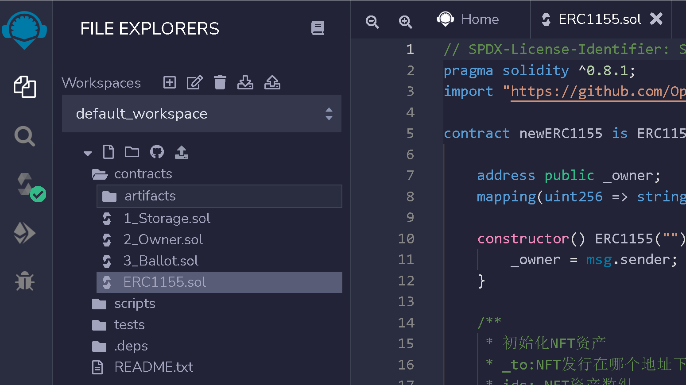
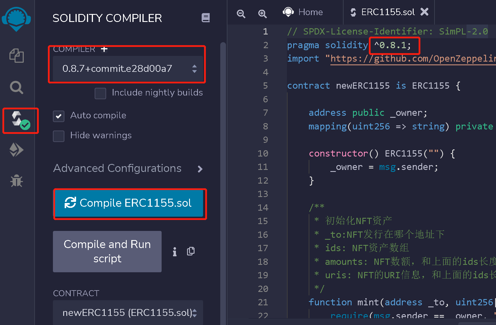
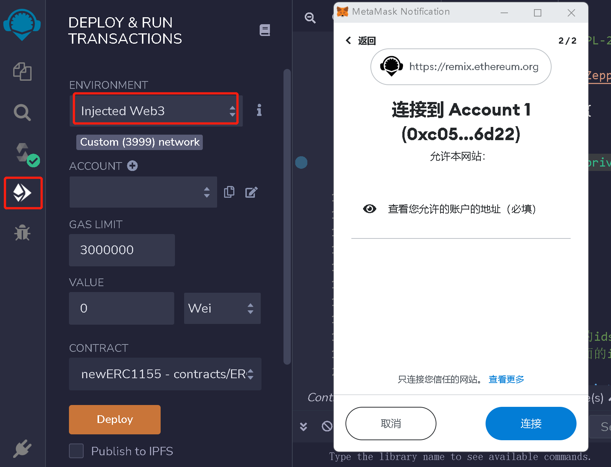
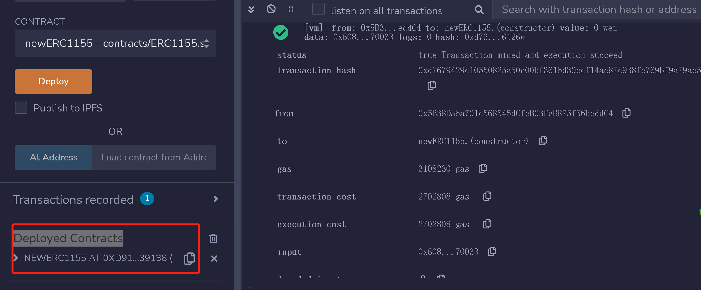
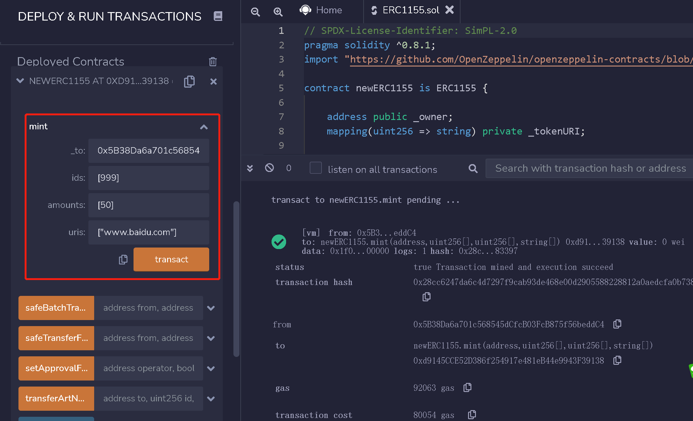
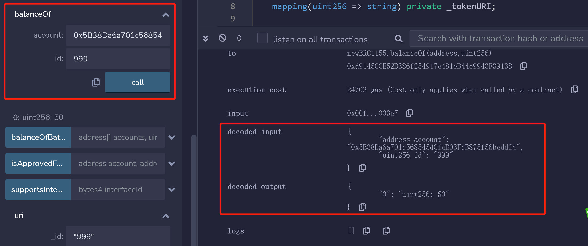
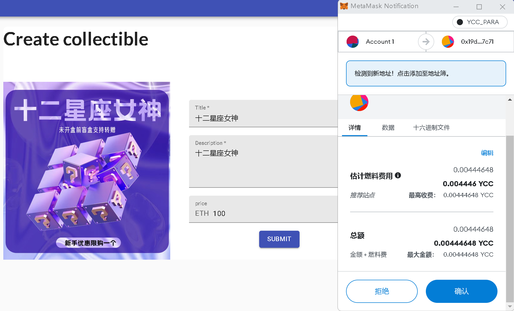
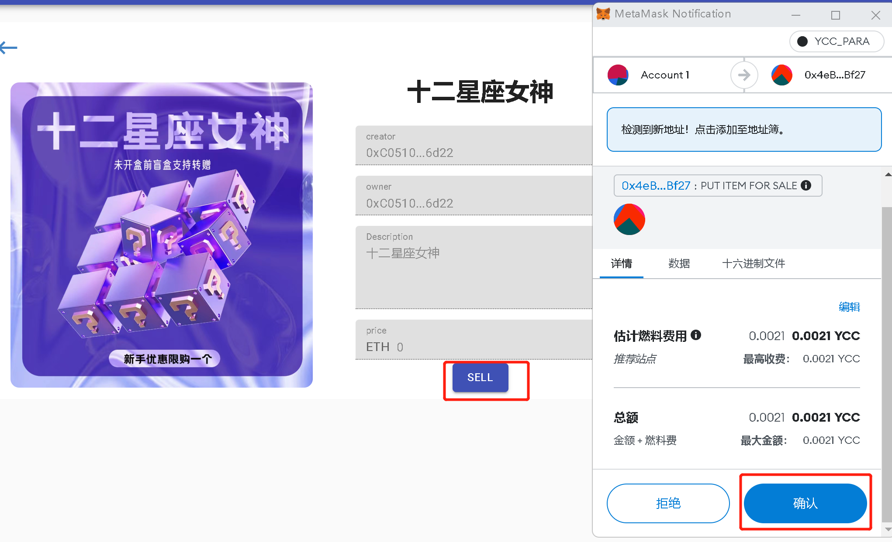
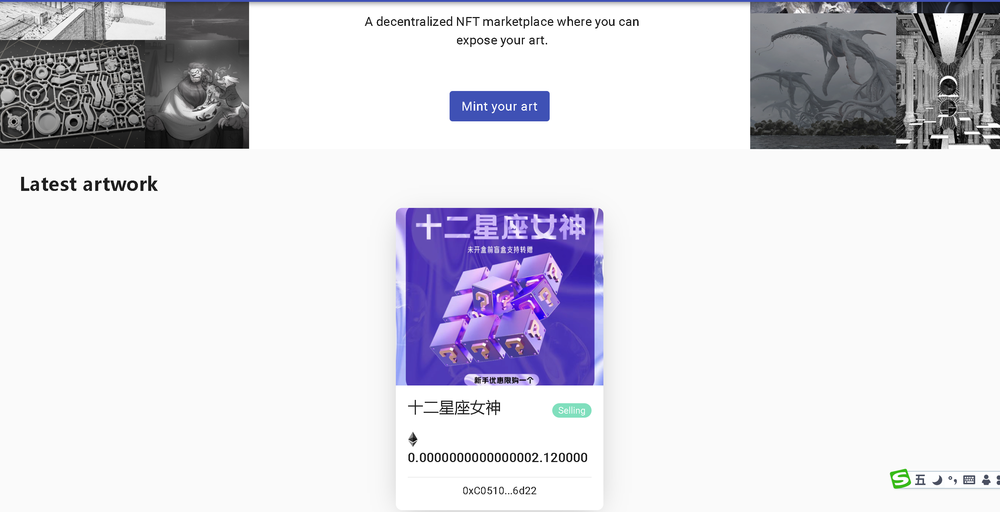

## 一. 通过remix和metamask在无手续费测试链上部署调用NFT合约  
1.  浏览器安装metamask插件，创建账户后添加主链和平行链的rpc连接  
    
新增RPC URL:  此处改成用户自己YCC平行链的rpc链接    
链ID: 使用YCC注册的固定值 3999    

2. 编译部署合约
- **准备测试合约**：可以参考 [[ERC1155合约]](../solidity/ERC1155ByManager.sol)     
- **准备合约编译器**：打开在线remix IDE:  https://remix.ethereum.org/   
- **新建工程文件**：在remix的workspace下，新建一个ERC1155.sol文件，并将上述参考合约内容黏贴进去。  
   
- **编译合约**：选用的编译器版本要大于等于合约中要求的版本
   
- **metamask连接remix**：环境选择[Injected Web3] -- 弹出metamask插件，提示允不允许连接此网站 -- 选择连接， 连接成功后metemask中配置的chainID和用户账户地址都会在remix界面中显示。  
   
- **部署合约到Chain33测试平行链上**：选择[deploy]按钮 -- 弹出matemask插件，提示部署合约所需的GAS费 (确保自己账户下拥有一定数量的代币) -- 点击确认-- 成功后会在控制台打印合约部署信息  
   
左侧红框中Deployed Contracts:  部署好的合约地址  
status: 合约部署的结果  
transaction hash: 合约部署成功返回的hash值  
from: 部署人的地址  
gas: 部署合约需要的gas  
- **调用合约**：点击[Deployed Contracts]边上下拉箭头，再点击[mint]函数边上的下拉箭头，输入mint函数所需的参数(注意数据类型要和solidity合约中定义的保持一致)   
   
- **查询结果**：点击[Deployed Contracts]边上下拉箭头，再点击[balanceof]函数边上的下拉箭头，输入balanceof函数所需的参数,点击[call]按钮查询  
   

##二. 通过truffle和metamask在YCC平行链上部署应用  
我们用以太坊上的一个应用（NFT-Marketplace）为例，说明如何把它快速移植到YCC平行链上。  
NFT-Marketplace开源地址：https://github.com/BravoNatalie/NFT-Marketplace， 实现了一个Demo性质的去中心化NFT交易市场，可以发行也可以买卖NFT。 

1. 环境准备
产品的客户端+服务端（运行在Win10机器上, 机器上的visual studio版本大于等于 2015） 
区块链(YCC主链+平行链运行在linux服务器上)  
python3  
Git工具  
Node  
Yarn或npm  
Truffle  
metamask浏览器插件 

2. 环境部署
- 通过git bash工具下载NFT市场开源代码  
```
git clone https://github.com/BravoNatalie/NFT-Marketplace.git  
```

- 通过yarn命令安装依赖（保证网络没有限制，如果有些依赖下载失败，可能需要科学上网） 
```
# 进入目录
cd NFT-Marketplace  
# 执行yarn命令
yarn  
```

- 修改truffle配置文件
```
# 在NFT-Marketplace目录下，修改truffle-config.js文件，
# 1. 在文件头增加const定义
const HDWalletProvider = require('@truffle/hdwallet-provider');
# 2. 增加以下YCC平行链网络的配置
    ycc: {
      network_id: "3999",       // YCC  network_id： 对应YCC的chainid，固定填写3999
      from: "0xc05109180ac5298e3a9b7d7e70abf98ffb986d22",  // 用户地址，需要保证地址下有燃料
      provider: function() {
        return new HDWalletProvider(mnemonic , "http://121.52.224.92:8546/"); // mnemonic：钱包助记词; url: YCC平行链对应的rpc地址
      }
    },
```

- 运行truffle工具，将./contracts/目录下的三个合约部署到链上
```
# 修改PATH环境变量，将node_modules/.bin加到PATH中
export PATH=$(pwd)/node_modules/.bin:$PATH
# 删除之前已经编译好的文件
cd client\src\contracts
rm -rf *
# 再回到NFT-Marketplace目录下，执行
truffle migrate --network  ycc
# truffle会将这三个合约文件编译部署到链上，出现以下提示代表部署成功
Deploying 'ArtMarketplace'
--------------------------
> transaction hash:    0xa1893aa3776589e2aceb1b9ed1a3355778d732dfd77c8593b1a7f2b7452feea5
> contract address:    0x4eB62CdCC3767937108cF88a41BDc9e6DE43Bf27
> block number:        424792
>......省略信息

Summary
=======
> Total deployments:   3
> Final cost:          0.03766312 ETH
```

-运行客户端和服务端
```
# 运行客户端
cd client
yarn
yarn start

# 运行服务端
cd backend
yarn
yarn start
```

3. 操作使用
-  访问前端并通过metamask登录，登录成功后自己的钱包地址会显示在右上角   
   
- 点击[Mint your art]发行一个NFT，在弹出的metamask插件中点确认交易   
   
- 发行成功后，NFT图片会在首页显示，点详情，再点[sell]按钮，就可将该NFT上架销售。  
   
- 其它用户在界面能看到上架的NFT，可进行购买  
   

**备注：以太坊的精度是10的18次方，chain33的精度是10的8次方，开发时要注意精度的转换， 处理细节待补充**